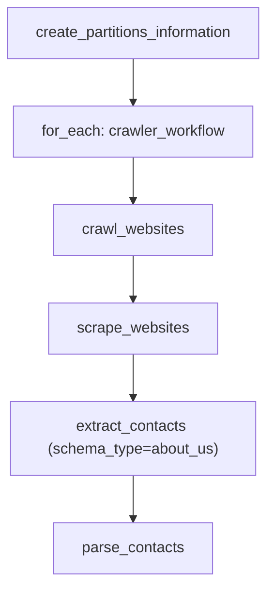
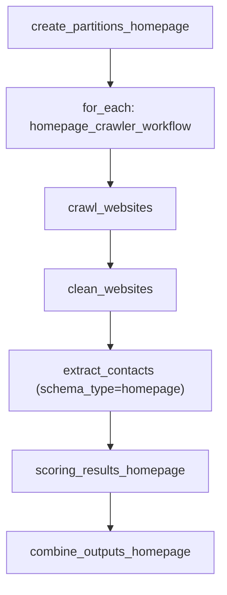
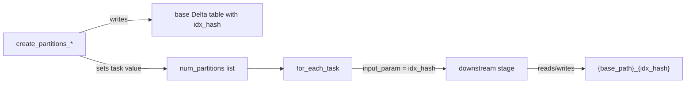
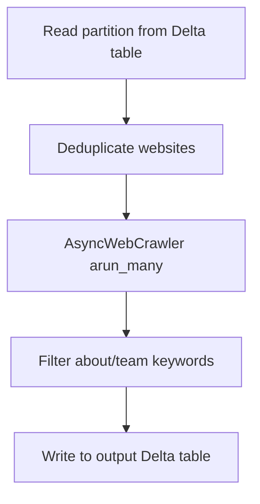
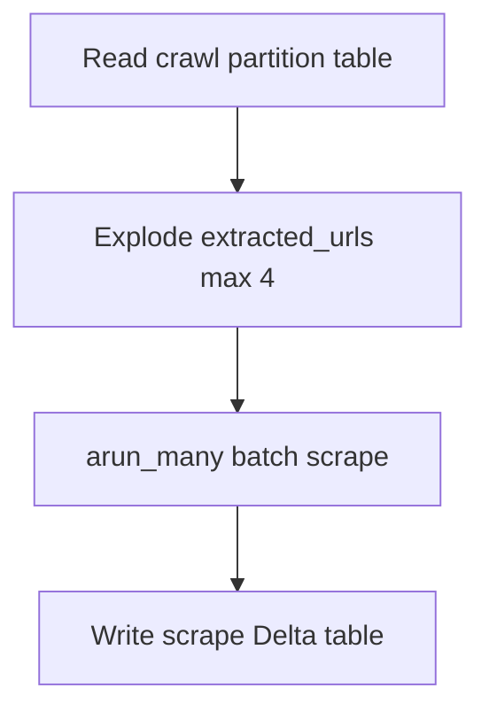
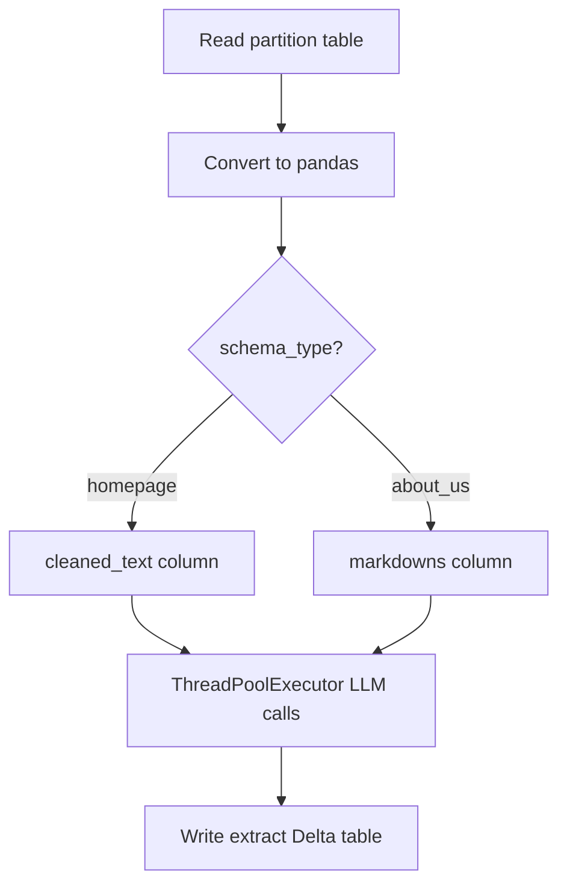
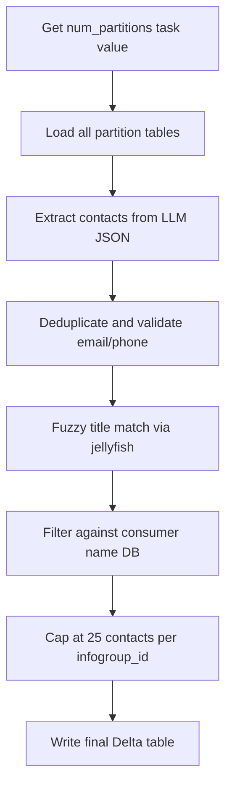
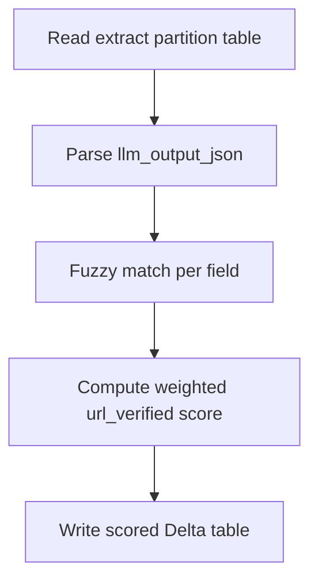
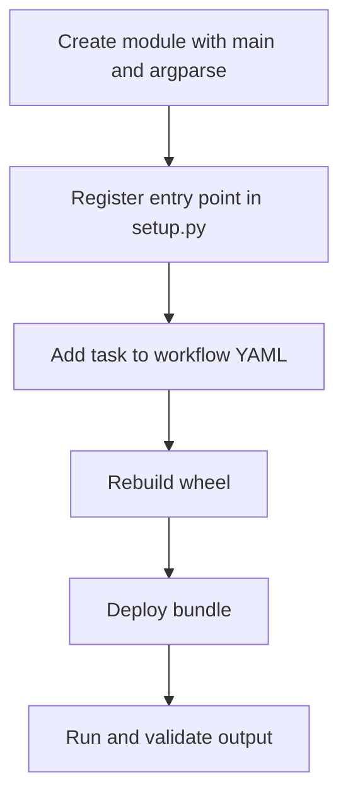
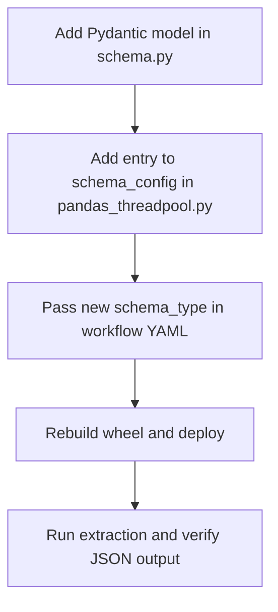

# mlp_website_information_scraper — Developer Playbook

## Stack and conventions

| Layer | Technology |
|-------|------------|
| Runtime | Databricks Spark 15.4.x-cpu-ml-scala2.12, single-node clusters (`local[*]`) |
| Packaging | Python wheel (`setup.py`), deployed via Databricks Asset Bundles |
| Crawling | crawl4ai, Playwright 1.43.0, BeautifulSoup4, nest_asyncio |
| Extraction | langchain 0.3.26, databricks-langchain 0.19.0, Pydantic schemas |
| Parsing | phonenumbers, jellyfish (Jaro-Winkler), pandas |
| Validation | fuzzywuzzy |
| Storage | Unity Catalog Delta tables (`main.*`), S3 via AWS instance profile |
| LLM endpoint | `contact-extraction-nova-micro` via `ChatDatabricks` |
| CI/CD | GitHub Actions deploying to dev / staging / prod Databricks workspaces |

**Conventions:**
- Every pipeline stage is a wheel entry point with a `main()` function and `argparse` CLI arguments.
- Partitioned tables use the naming pattern `{base_path}_{idx_hash}`; `--input` carries the partition id.
- The partition-creation task sets a Databricks task value `num_partitions` consumed by `for_each_task`.
- Rebuild the wheel (`python setup.py sdist bdist_wheel`) before every `databricks bundle deploy`.

---

## Repository layout

| Path | Purpose |
|------|---------|
| `databricks.yml` | Bundle root — includes all `resources/*.yml`, defines `validate-tags` script |
| `setup.py` | Wheel packaging and console entry points |
| `resources/global_variables.yml` | Shared bundle variables (libraries, tags, permissions, instance profiles) |
| `resources/targets.yml` | Environment overrides for dev, staging, prod |
| `resources/mlp_website_information_scraper_job.yml` | Contact pipeline orchestrator |
| `resources/mlp_website_homepage_scraper_job.yml` | Homepage pipeline orchestrator |
| `resources/crawler_workflow.yml` | Per-partition contact crawl/scrape/extract sub-job |
| `resources/homepage_crawler_workflow.yml` | Per-partition homepage crawl/clean/extract/score sub-job |
| `src/mlp_website_information_scraper/crawl/` | Homepage crawling via crawl4ai |
| `src/mlp_website_information_scraper/scrape/` | About/Team page scraping |
| `src/mlp_website_information_scraper/extract/` | LLM extraction (`pandas_threadpool.py` is production) |
| `src/mlp_website_information_scraper/parse/` | Contact parsing, validation, deduplication |
| `src/mlp_website_information_scraper/clean_html/` | Homepage HTML cleaning |
| `src/mlp_website_information_scraper/validation_homepage/` | Fuzzy scoring of extracted vs source fields |
| `src/mlp_website_information_scraper/combine_output/` | Union partitions and write S3 gzipped CSV |
| `src/mlp_website_information_scraper/create_partitions/` | CSV → partitioned Delta table |
| `src/mlp_website_information_scraper/utils/` | Logging and working-hours normalization |
| `.github/workflows/` | CI deploy pipelines |

---

## Pipeline architecture

### Contact pipeline



### Homepage pipeline



### Partition naming contract



Downstream stages receive `--input` equal to the `idx_hash` value. They construct table names as `{--input_path}_{--input}` and `{--output_path}_{--input}`.

---

## Wheel entry points reference

All entry points are registered in `setup.py` under the `entry_points` group.

---

### create_partitions_information

Loads an S3 CSV, assigns `idx_hash` partitions, writes a Delta table, and sets the `num_partitions` task value.

#### Parameters

| Name | Type | Required | Default | Description |
|------|------|----------|---------|-------------|
| `--partition_size` | int | No | `1000` | Records per partition |
| `--input_path` | str | Yes | — | S3 glob path for input CSV files |
| `--partitions_output_path` | str | Yes | — | Output Delta table for partitioned data |
| `--cols_to_select` | str | No | 17-column default list | Comma-separated columns to select from input |

Default `--cols_to_select` columns: `infogroup_id`, `place_type`, `labels.place_type`, `in_business`, `labels.in_business`, `name`, `street`, `city`, `state`, `labels.state`, `postal_code`, `phone`, `website`, `website_status`, `labels.website_status`, `contacts_count`.

#### Side effects

- Writes Delta table (overwrite, mergeSchema)
- Sets Databricks task value `num_partitions` on task key `create-partitions-information`
- Raises `ValueError` if expected columns are missing from input CSV

#### Usage example

```
create_partitions_information --input_path "s3://bucket/path/*.csv.gz" --partitions_output_path main.contact_us_crawler.with_contacts_june --partition_size 1500
```

---

### create_partitions_homepage

Loads an S3 CSV, assigns `idx_hash` partitions, writes a Delta table, and sets the `num_partitions` task value.

#### Parameters

| Name | Type | Required | Default | Description |
|------|------|----------|---------|-------------|
| `--partition_size` | int | No | `1000` | Records per partition |
| `--input_path` | str | No | `1` | S3 glob path for input CSV (jobs always pass explicit values) |
| `--partitions_output_path` | str | No | `0` | Output Delta table (jobs always pass explicit values) |

#### Side effects

- Writes Delta table (overwrite, mergeSchema)
- Sets Databricks task value `num_partitions` on task key `create-partitions-homepage`

#### Usage example

```
create_partitions_homepage --input_path "s3://bucket/path/*.csv.gz" --partitions_output_path main.web_crawling.homepage_input_partitioned --partition_size 3000
```

---

### crawl_websites

Crawls business homepages asynchronously via crawl4ai, discovers About/Team/Leadership links, and writes crawl results.

#### Flow



#### Parameters

| Name | Type | Required | Default | Description |
|------|------|----------|---------|-------------|
| `--input` | str | Yes | — | Partition id (`idx_hash` value) |
| `--input_path` | str | Yes | — | Base Delta table path (reads `{input_path}` filtered by `idx_hash`) |
| `--output_path` | str | Yes | — | Base output path (writes to `{output_path}_{input}`) |
| `--cols_to_select` | str | No | — | Comma-separated columns to select from input |

#### Returns

Spark DataFrame with crawl results.

#### Side effects

- Installs Playwright Chromium via subprocess on module load
- Writes Delta table `{output_path}_{input}` (overwrite)
- Network calls to crawled websites

#### Usage example

```
crawl_websites --input 1 --input_path main.contact_us_crawler.with_contacts_june --output_path main.contact_us_crawler.with_crawl_june --cols_to_select infogroup_id,website,url_status,name,street,city,state,phone,postal_code
```

---

### scrape_websites

Explodes discovered URLs (max 4 per record), scrapes them via crawl4ai `arun_many`, and writes parsed content.

#### Flow



#### Parameters

| Name | Type | Required | Default | Description |
|------|------|----------|---------|-------------|
| `--input` | str | Yes | — | Partition id |
| `--input_path` | str | Yes | — | Base crawl table path (reads `{input_path}_{input}`) |
| `--output_path` | str | Yes | — | Base output path (writes to `{output_path}_{input}`) |

#### Side effects

- Writes Delta table `{output_path}_{input}` (overwrite)
- Network calls to scraped URLs

#### Usage example

```
scrape_websites --input 1 --input_path main.contact_us_crawler.with_crawl_june --output_path main.contact_us_crawler.with_scrape_june
```

---

### extract_contacts

Parallel LLM extraction using `ThreadPoolExecutor` (10 workers) and `ChatDatabricks` endpoint.

#### Flow



#### Parameters

| Name | Type | Required | Default | Description |
|------|------|----------|---------|-------------|
| `--input` | str | Yes | — | Partition id |
| `--input_path` | str | Yes | — | Base input table path (reads `{input_path}_{input}`) |
| `--output_path` | str | Yes | — | Base output path (writes to `{output_path}_{input}`) |
| `--schema_type` | str | Yes | — | `homepage` (BusinessDetails + `cleaned_text`) or `about_us` (BusinessInformation + `markdowns`) |

#### Side effects

- Network calls to `contact-extraction-nova-micro` endpoint
- Writes Delta table `{output_path}_{input}` (overwrite, mergeSchema)
- Raises `ValueError` if `schema_type` is not `homepage` or `about_us`
- Skips rows where `error` column is not null
- Truncates input text to 100,000 characters per document

#### Usage example

```
extract_contacts --input 1 --input_path main.contact_us_crawler.with_scrape_june --output_path main.contact_us_crawler.with_extract_june --schema_type about_us
```

---

### parse_contacts

Consolidates all partition extract tables, validates contacts, deduplicates, fuzzy-matches titles, and filters against consumer name database.

#### Flow



#### Parameters

| Name | Type | Required | Default | Description |
|------|------|----------|---------|-------------|
| `--input` | str | No | — | Fallback start partition id when task values unavailable |
| `--count` | int | No | — | Fallback number of partitions when task values unavailable |
| `--input_path` | str | Yes | — | Base path for partitioned extract tables |
| `--output_path` | str | Yes | — | Output Delta table for parsed contacts |

#### Side effects

- Reads all `{input_path}_{partition_id}` tables (skips missing tables)
- Reads `main.consumer_staging.odbx_silver_fs` for consumer name lookup
- Reads `dbfs:/FileStore/Mokshit Oswal/Contacts-Data/Final/title_codes.csv` for title matching
- Writes final Delta table (overwrite)

#### Usage example

```
parse_contacts --input_path main.contact_us_crawler.with_extract_june --output_path main.contact_us_crawler.final_with_contacts_june
```

---

### clean_websites

Parses homepage HTML via BeautifulSoup pandas UDFs, strips copyright text, and produces `cleaned_text`.

#### Parameters

| Name | Type | Required | Default | Description |
|------|------|----------|---------|-------------|
| `--input` | str | Yes | — | Partition id |
| `--input_path` | str | Yes | — | Base crawl table path (reads `{input_path}_{input}`) |
| `--output_path` | str | Yes | — | Base output path (writes to `{output_path}_{input}`) |

#### Side effects

- Writes Delta table `{output_path}_{input}` (overwrite, mergeSchema)

#### Usage example

```
clean_websites --input 1 --input_path main.web_crawling.crawling_output --output_path main.web_crawling.cleaned_html_output
```

---

### scoring_results_homepage

Fuzzy-matches extracted fields against source records and assigns `url_verified` label and score.

#### Flow



#### Parameters

| Name | Type | Required | Default | Description |
|------|------|----------|---------|-------------|
| `--input` | str | Yes | — | Partition id |
| `--input_path` | str | Yes | — | Base extract table path (reads `{input_path}_{input}`) |
| `--output_path` | str | Yes | — | Base output path (writes to `{output_path}_{input}`) |

#### Side effects

- Writes Delta table `{output_path}_{input}` (overwrite, mergeSchema)

#### `url_verified` labels

| Score range | Label |
|-------------|-------|
| 70–100 | High |
| 60 | Medium |
| 50 | Medium |
| 40 | Low |
| 0 | No Match |

#### Usage example

```
scoring_results_homepage --input 1 --input_path main.web_crawling.extracted_homepage_output --output_path main.web_crawling.output_homepage
```

---

### combine_outputs_homepage

Unions all scored partition tables, renames columns, and writes a gzipped CSV to S3.

#### Parameters

| Name | Type | Required | Default | Description |
|------|------|----------|---------|-------------|
| `--input_path` | str | No | `""` | Base path for scored partition tables |
| `--output_path` | str | No | `""` | S3 output directory (e.g. `s3://bucket/path/`) |

#### Side effects

- Reads `num_partitions` task value from `create-partitions-homepage`
- Reads all `{input_path}_{partition_id}` tables
- Writes gzipped CSV to S3 with filename pattern `webscraping_report_{uuid}_{date}_{time}.csv.gz` under a date folder

#### Usage example

```
combine_outputs_homepage --input_path main.web_crawling.output_homepage --output_path s3://ds-airflow-production/homepage_crawling/output/
```

---

## Pydantic schemas

Defined in `extract/schema.py`. Used by `extract_contacts` based on `--schema_type`.

### BusinessDetails (`schema_type=homepage`)

| Field | Type | Description |
|-------|------|-------------|
| `name` | Optional[str] | Business or company name |
| `suite_number` | Optional[str] | Suite or apartment number |
| `street` | Optional[str] | Street address |
| `city` | Optional[str] | City |
| `state` | Optional[str] | 2-letter state code |
| `postal_code` | Optional[str] | Postal or ZIP code |
| `country_code` | Optional[str] | 2-letter country code |
| `phone` | Optional[str] | Contact phone number |
| `year_of_establishment` | Optional[str] | Year founded (ignores copyright/footer years) |
| `url` | Optional[str] | Website URL |
| `working_hours` | Optional[BusinessWorkingHours] | Per-day open/close times |
| `error` | Optional[str] | Error message if extraction failed |

### BusinessWorkingHours

14 optional string fields: `{weekday}_opens_at` and `{weekday}_closes_at` for Monday through Sunday. Times are normalized to 24-hour HH:MM via `normalize_working_hours_dict`.

### BusinessInformation (`schema_type=about_us`)

| Field | Type | Description |
|-------|------|-------------|
| `business_name` | Optional[str] | Business or organization name |
| `business_email` | Optional[str] | Primary business email |
| `business_phone` | Optional[str] | Primary business phone |
| `contacts` | List[Contact] | List of associated contacts |
| `error` | Optional[str] | Error message if extraction failed |

### Contact

| Field | Type | Description |
|-------|------|-------------|
| `name` | Optional[str] | Full name |
| `email` | Optional[str] | Email address |
| `phone` | Optional[str] | Phone number |
| `role` | Optional[str] | Job title or role |

---

## Job wiring reference

### Contact pipeline — dev defaults

| Task | Entry point | Cluster | Key table paths |
|------|-------------|---------|-----------------|
| `create-partitions-information` | `create_partitions_information` | m5d.2xlarge | Input: S3 contact-us CSV → `main.contact_us_crawler.with_contacts_june` |
| `crawler_workflow` (per partition) | — | shared m5d.2xlarge + r5d.large | crawl → `with_crawl_june`, scrape → `with_scrape_june`, extract → `with_extract_june` |
| `parse-contacts` | `parse_contacts` | r5d.16xlarge | Input: `with_extract_june` → Output: `final_with_contacts_june` |

### Contact pipeline — staging/prod overrides

Staging and prod override `crawler_workflow` in `targets.yml` to use `main.places_sample.*` tables:

| Stage | Table path |
|-------|------------|
| Crawl input | `main.places_sample.remaining_new_scope_one_contact` |
| Crawl output | `main.places_sample.crawl_new` |
| Scrape output | `main.places_sample.scrape_new` |
| Extract output | `main.places_sample.extract_new` |

### Homepage pipeline — all environments

| Task | Entry point | Cluster | Key table paths |
|------|-------------|---------|-----------------|
| `create-partitions-homepage` | `create_partitions_homepage` | m5d.2xlarge | Input: S3 homepage CSV → `main.web_crawling.homepage_input_partitioned` |
| `homepage_crawler_workflow` (per partition) | — | c4.8xlarge, m5d.2xlarge, r5d.large | crawl → `crawling_output`, clean → `cleaned_html_output`, extract → `extracted_homepage_output`, score → `output_param` |
| `combine_outputs_homepage` | `combine_outputs_homepage` | r5d.large | Input: `main.web_crawling.output_homepage` → S3 output |

---

## Bundle variables

From `resources/global_variables.yml`:

| Variable | Default | Description |
|----------|---------|-------------|
| `map_migrated` | `d-server-028bqm2pgp95c2` | AWS EC2 provisioning tag |
| `BusinessUnit` | `dataextraction` | Cost allocation tag |
| `Project` | `contact_information_scraper` | Project name tag |
| `Owner` | `mokshit.oswal@data-axle.com` | Repository owner |
| `instance_profile` | `arn:aws:iam::899544442471:instance-profile/databricks-s3` | AWS IAM profile (dev) |
| `instance_profile_staging_prod` | `arn:aws:iam::372312015179:instance-profile/databricks-workspace-stack-staging-access-data-buckets` | AWS IAM profile (staging/prod) |
| `catalog_name` | `main` | Unity Catalog name |
| `crawling_libraries` | whl + crawl4ai, beautifulsoup4, playwright==1.43.0, nest_asyncio | Crawl/scrape task libraries |
| `extraction_libraries` | whl + langchain==0.3.26, databricks-langchain==0.19.0, databricks-vectorsearch==0.57, databricks-sdk==0.65.0, pandas==2.2.3 | LLM extraction libraries |
| `parsing_libraries` | whl + phonenumbers, jellyfish, pandas | Contact parsing libraries |
| `clean_libraries` | whl + beautifulsoup4, pandas | HTML cleaning libraries |
| `validation_libraries` | whl + fuzzywuzzy, pandas | Scoring libraries |
| `permissions` | 6 users with CAN_MANAGE | Job access permissions |

---

## How to add a new pipeline stage

### Workflow overview



Follow `clean_websites` in `clean_html/clean_homepage_html.py` as the reference implementation for a mid-pipeline stage.

### Step 1: Create the module

Location: `src/mlp_website_information_scraper/<stage_name>/`

Create a module with:
- `main()` function with `argparse` arguments following the partition contract (`--input`, `--input_path`, `--output_path`)
- Read from `{input_path}_{input}`, write to `{output_path}_{input}`
- Use `get_logger()` from `utils/logger_utils.py`

Verification: `python setup.py sdist bdist_wheel` → Expected: wheel builds without errors.

### Step 2: Register the entry point

File: `setup.py`

Add a line to the `entry_points` list matching the existing pattern:

```
<command_name>=mlp_website_information_scraper.<package>.<module>:main
```

Verification: Inspect the built wheel or run `pip install dist/*.whl` and confirm the command is available.

### Step 3: Wire into the workflow YAML

File: `resources/<workflow>.yml`

Add a new task block with:
- `depends_on` pointing to the upstream task
- `python_wheel_task` with `package_name: mlp_website_information_scraper`, your `entry_point`, and `parameters` using `{{job.parameters.input_param}}` for `--input`
- `libraries` referencing the appropriate `${var.*_libraries}` variable
- `timeout_seconds` as needed

Verification: `databricks bundle validate -t dev` → Expected: validation passes.

### Step 4: Deploy and validate

```bash
python setup.py sdist bdist_wheel
databricks bundle deploy --target dev
databricks bundle run <parent_job_name>
```

Expected: new task appears in the job run and writes output to the expected `{output_path}_{partition_id}` table.

---

## How to add a new schema type

### Workflow overview



### Step 1: Define the Pydantic model

File: `src/mlp_website_information_scraper/extract/schema.py`

Add a new `BaseModel` class with `Field` descriptions. Follow `BusinessDetails` or `BusinessInformation` as the pattern.

### Step 2: Register in schema_config

File: `src/mlp_website_information_scraper/extract/pandas_threadpool.py`

Add an entry to the `schema_config` dict inside `main()`:

| Key | Value |
|-----|-------|
| `pydantic_obj` | Your new Pydantic class |
| `text_column` | Column name containing input text for the LLM |
| `log_msg` | Log message string |

### Step 3: Update workflow YAML

Pass `--schema_type <your_type>` in the `extract_contacts` task parameters of the relevant workflow YAML.

### Step 4: Deploy and test

```bash
python setup.py sdist bdist_wheel
databricks bundle deploy --target dev
```

Run the workflow and inspect `llm_output_json` in the output partition table.

---

## External dependencies

| Resource | Used by | Purpose |
|----------|---------|---------|
| `contact-extraction-nova-micro` | `extract_contacts` | Databricks model serving endpoint for LLM extraction |
| `main.consumer_staging.odbx_silver_fs` | `parse_contacts` | Consumer name lookup for contact filtering |
| `dbfs:/FileStore/Mokshit Oswal/Contacts-Data/Final/title_codes.csv` | `parse_contacts` | Title code reference for fuzzy role matching |
| AWS instance profile | All jobs | S3 read/write access |

---

## CI/CD

| Trigger | Workflow | Target | Token secret |
|---------|----------|--------|--------------|
| Pull request to `main` | `onpullrequest.yml` | `dev` | `MLP_DEV_SECRET` |
| Push to `main` | `onpullrequestmerge.yml` | `staging` | `MLP_STAGING_SECRET` |
| Push tag `v*` | `onrelease.yml` | `prod` | `MLP_PROD_SECRET` |

Each workflow runs: bundle validate → tag validation → bundle deploy.

---

## Unwired and legacy modules

These modules exist in the repository but are **not** referenced in any job YAML:

| Module | Entry point | Notes |
|--------|-------------|-------|
| `extract/extract_main.py` | — | Older Spark `@pandas_udf` extraction approach with hardcoded `main.places_sample.*` tables |
| `extract/opt_pandas.py` | — | Optimization experiment |
| `extract/opt_claude.py` | — | Claude-based optimization experiment |
| `create_partitions/create_table_partitions_main.py` | `create_partitions` | Legacy CSV partition writer; reads `main.places_sample.zero_contacts`, writes CSV to hardcoded DBFS path |
| `main.py` | — | Stub ("Hello World") — not used by any job |

### create_partitions (legacy entry point)

| Name | Type | Required | Default | Description |
|------|------|----------|---------|-------------|
| `--num_partitions` | int | No | `4` | Number of partitions |
| `--records_per_partition` | int | No | `1` | Records per partition |
| `--start_index` | int | No | `0` | Start index |

Side effects: Reads `main.places_sample.zero_contacts`, writes CSV partitions to `/FileStore/Mokshit Oswal/nova_50k_records/{date}/`.

Do not wire legacy modules into production jobs without review.

---

## Agent context

### What this project does

Databricks bundle for crawling business websites and LLM-extracting structured contact or homepage data into Delta tables and S3.

### Stack

- Python wheel on Databricks 15.4.x single-node Spark clusters
- crawl4ai + Playwright for async web crawling
- databricks-langchain + Pydantic for LLM extraction
- Delta tables in Unity Catalog `main` catalog
- S3 via AWS instance profiles

### Coding conventions

- Every stage is a `main()` entry point with `argparse` CLI
- Partition tables use `{base_path}_{idx_hash}` suffix pattern
- Use `get_logger()` from `utils/logger_utils.py` for logging
- Rebuild wheel before every deploy

### What NOT to do

- Do not use `extract_main.py`, `opt_pandas.py`, or `opt_claude.py` in job YAML — production extraction is `pandas_threadpool.py` only
- Do not skip the wheel rebuild before `databricks bundle deploy` — jobs install from `../dist/*.whl`
- Do not change partition table naming — all downstream stages depend on `{base_path}_{idx_hash}` suffix convention
- Do not assume `create_partitions_homepage` argparse defaults (`1` and `0`) are valid — jobs always pass explicit S3 paths and table names
- Do not run `parse_contacts` without access to `title_codes.csv` on DBFS and `main.consumer_staging.odbx_silver_fs` — both are required at runtime
