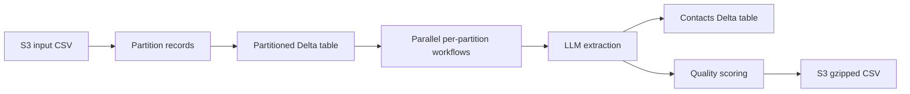
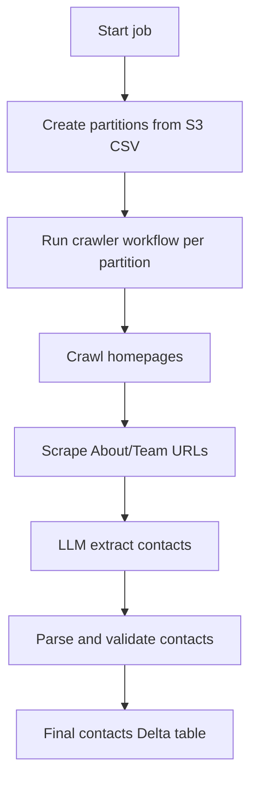
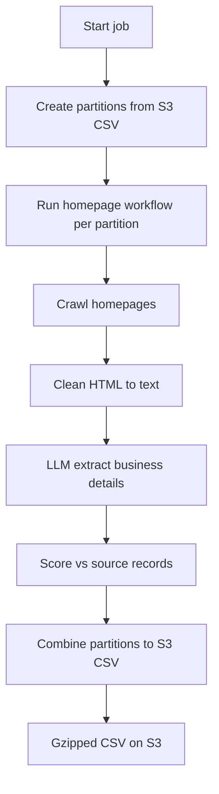
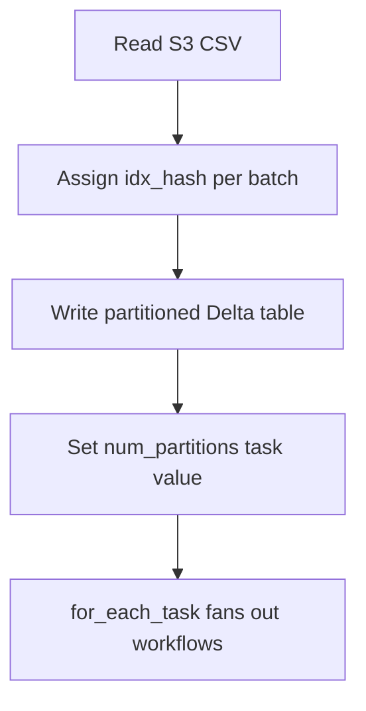
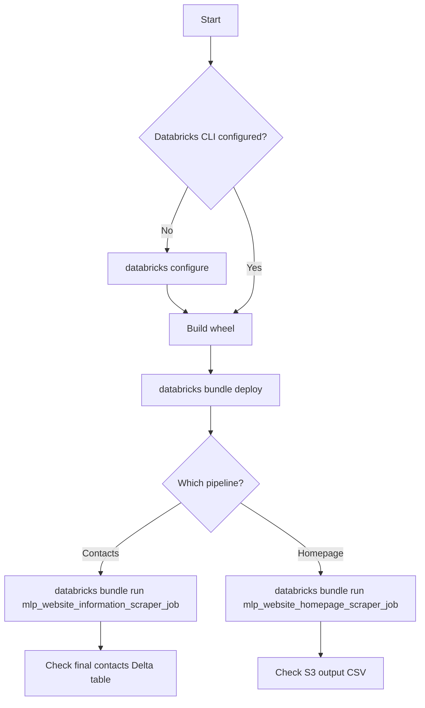
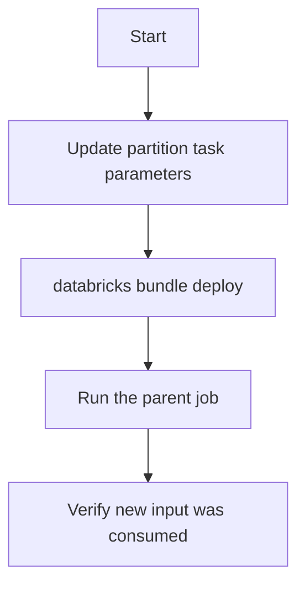

# mlp_website_information_scraper — User Playbook

## What this project does

This project crawls business websites on Databricks, extracts structured information using a hosted LLM, and writes results to Delta tables or S3. The **Contact scraper** discovers About/Team/Leadership pages, extracts contact people, validates and deduplicates them, and writes a final contacts table. The **Homepage scraper** crawls homepages, cleans HTML, extracts business details (address, hours, phone, etc.), scores extraction quality against source records, and exports a gzipped CSV to S3.

## How it fits together



Both pipelines start from an S3 CSV of business records, partition rows for parallel processing, run crawl-and-extract workflows per partition, then consolidate results. The contact pipeline ends in a Delta table; the homepage pipeline ends in S3.

## Core features

- **Partitioned parallel crawling**: Input CSVs are split into batches by `idx_hash` and processed concurrently (up to 24 partitions for contacts, 5 for homepage).
- **LLM extraction with two schema types**: `about_us` extracts contacts from scraped About/Team pages; `homepage` extracts business details from cleaned homepage HTML.
- **Contact validation and deduplication**: Emails and US phone numbers are validated; contacts are deduplicated, title-matched, and filtered against a consumer name database.
- **Homepage quality scoring**: Extracted fields are fuzzy-matched against source records and assigned a `url_verified` label (High, Medium, Low, No Match).
- **S3 CSV export**: Homepage results are combined across partitions and written as a timestamped gzipped CSV.

## Components

### Contact scraper job (`mlp_website_information_scraper_job`)



**How to run:**

```bash
databricks bundle run mlp_website_information_scraper_job
```

**What you provide:** An S3 glob path to a gzipped CSV of business records (configured in the job's partition task). Default partition size is 1500 records.

**What you get:** A Delta table `main.contact_us_crawler.final_with_contacts_june` containing validated, deduplicated contacts with columns such as `infogroup_id`, `website`, `company_name`, `contact_name`, `contact_email`, `contact_phone`, `contact_role_label`, and `contact_role_value`.

### Homepage scraper job (`mlp_website_homepage_scraper_job`)



**How to run:**

```bash
databricks bundle run mlp_website_homepage_scraper_job
```

**What you provide:** An S3 glob path to a gzipped CSV of business records (configured in the job's partition task). Default partition size is 3000 records.

**What you get:** A gzipped CSV under `s3://ds-airflow-production/homepage_crawling/output/` with a timestamped filename. Columns include `infogroup_id`, `website`, `company_name`, `street_address`, `city`, `state`, `zip_code`, `phone`, `business_working_hours`, `url_verified`, and `url_verified_score`.

On failure, email notifications are sent to the configured team distribution list.

### Partitioning



**What you provide:** S3 input path, output Delta table name, and `--partition_size` (records per partition).

**What you get:** A Delta table with an `idx_hash` column. Downstream tasks read `{table}_{idx_hash}` and filter on the partition id passed as `--input`.

### Environments

| Target | Workspace | Deploy trigger | Notes |
|--------|-----------|----------------|-------|
| `dev` | `dbc-cacb962d-262b.cloud.databricks.com` | Pull request to `main` | Development mode — job names get a `[dev username]` prefix |
| `staging` | `dbc-28b42527-823f.cloud.databricks.com` | Merge to `main` | Uses `main.places_sample.*` tables for contact crawler workflow |
| `prod` | `dbc-e9168094-a806.cloud.databricks.com` | Push tag matching `v*` | Production mode; shared bundle root path |

---

## How to deploy and run

### Before you begin

- Databricks CLI installed and authenticated (`databricks configure`)
- Access to the target Databricks workspace
- Python with `wheel` package available to build the project wheel

### Flow



### Steps

1. **Authenticate** → Run `databricks configure` and enter workspace host and token. Expected: CLI responds without auth errors.

2. **Build the wheel** → Run `python setup.py sdist bdist_wheel`. Expected: `dist/` contains a `.whl` file.

3. **Deploy the bundle** → Run `databricks bundle deploy --target dev` (or `staging` / `prod`). Expected: jobs appear in Databricks Workflows with the configured task definitions.

4. **Run a job** → Run `databricks bundle run mlp_website_information_scraper_job` or `databricks bundle run mlp_website_homepage_scraper_job`. Expected: job run starts in Workflows UI.

5. **Monitor** → Open Databricks Workflows, select the job run, and watch task progress. The contact job runs up to 24 parallel crawler workflows; the homepage job runs up to 5.

### Verify it worked

**Contact pipeline:** Query the output Delta table (default `main.contact_us_crawler.final_with_contacts_june`) and confirm rows with non-null `contact_name` values exist.

**Homepage pipeline:** List objects under `s3://ds-airflow-production/homepage_crawling/output/` and confirm a new `webscraping_report_*.csv.gz` file with today's date folder exists.

---

## How to change input data

### Flow



### Steps

1. **Update the partition task parameters** in the bundle configuration for the target job:
   - Contact job: `create-partitions-information` task — change `--input_path` (S3 glob) and optionally `--partition_size` and `--partitions_output_path`.
   - Homepage job: `create-partitions-homepage` task — change `--input_path`, `--partition_size`, and `--partitions_output_path`.

2. **Redeploy** → Run `databricks bundle deploy --target <target>`. Expected: updated parameters appear in the job definition.

3. **Run the job** → Expected: partition task reads the new S3 path and writes to the configured output table.

4. **Verify** → Check the partitioned Delta table row count matches expectations for the new input file.

---

## Job parameter reference

### `mlp_website_information_scraper_job`

This job has no top-level `parameters` block. Task-level parameters are fixed in the bundle definition.

| Task | Key parameters | Default values |
|------|----------------|----------------|
| `create-partitions-information` | `--input_path`, `--partitions_output_path`, `--partition_size` | S3 contact-us CSV glob, `main.contact_us_crawler.with_contacts_june`, `1500` |
| `parallel-crawler-workflow` | `partitions_path`, `input_param` | `main.contact_us_crawler.with_contacts_june`, partition id from `for_each` |
| `parse-contacts` | `--input_path`, `--output_path` | `main.contact_us_crawler.with_extract_june`, `main.contact_us_crawler.final_with_contacts_june` |

| Job setting | Value |
|-------------|-------|
| `max_concurrent_runs` | 24 |
| `for_each_task.concurrency` | 24 |

### `crawler_workflow`

| Parameter | Default | Description |
|-----------|---------|-------------|
| `partitions_path` | `main.contact_us_crawler.with_contacts_june` | Partitioned input Delta table with `idx_hash` column |
| `input_param` | `""` | Partition id (`idx_hash` value) passed to each task as `--input` |

| Task | Timeout (seconds) |
|------|-------------------|
| `crawl-websites` | 3600 |
| `scrape-websites` | 3600 (4800 in staging/prod overrides) |
| `extract-contacts` | 3600 |

In **staging** and **prod**, the crawler workflow uses `main.places_sample.*` table paths instead of `main.contact_us_crawler.*`.

### `mlp_website_homepage_scraper_job`

| Task | Key parameters | Default values |
|------|----------------|----------------|
| `create-partitions-homepage` | `--input_path`, `--partitions_output_path`, `--partition_size` | S3 homepage CSV glob, `main.web_crawling.homepage_input_partitioned`, `3000` |
| `parallel-homepage-crawler-workflow` | `partitions_path`, `input_param`, `output_param` | `main.web_crawling.homepage_input_partitioned`, partition id, `main.web_crawling.output_homepage` |
| `combine_outputs_homepage` | `--input_path`, `--output_path` | `main.web_crawling.output_homepage`, `s3://ds-airflow-production/homepage_crawling/output/` |

| Job setting | Value |
|-------------|-------|
| `max_concurrent_runs` | 5 |
| `for_each_task.concurrency` | 5 |

### `homepage_crawler_workflow`

| Parameter | Default | Description |
|-----------|---------|-------------|
| `partitions_path` | `""` | Partitioned input Delta table (set by parent job) |
| `input_param` | `""` | Partition id passed to each task as `--input` |
| `output_param` | `""` | Base output table for scoring results (set by parent job) |

| Task | Timeout (seconds) | Cluster |
|------|-------------------|---------|
| `crawl-websites-homepage` | 7200 | c4.8xlarge |
| `clean-websites-homepage` | 4500 | m5d.2xlarge |
| `extract-homepage` | 4500 | m5d.2xlarge |
| `scoring-results-homepage` | 4500 | r5d.large |

---

## LLM extraction schema types

| `schema_type` value | Used in | Extracts |
|---------------------|---------|----------|
| `about_us` | Contact pipeline (`extract-contacts` task) | Business name, email, phone, and a list of contacts (name, email, phone, role) |
| `homepage` | Homepage pipeline (`extract-homepage` task) | Business name, address, phone, year of establishment, URL, and per-day working hours |

Both schema types use the `contact-extraction-nova-micro` Databricks model serving endpoint.
